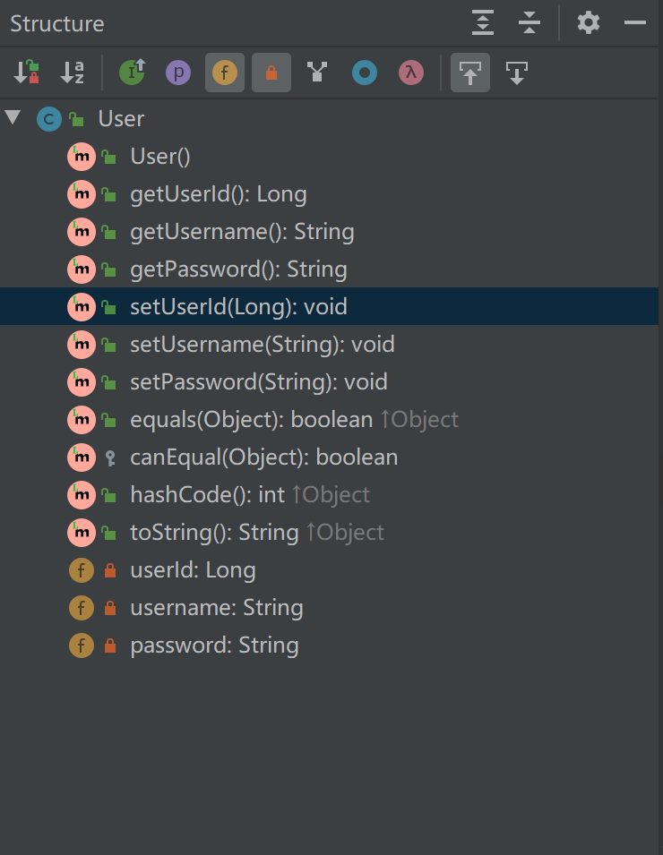

##### 1.使用IntelliJ IDEA


##### 2.安装插件

##### 


##### 3.配置pom

```
<dependency>
      <groupId>org.projectlombok</groupId>
      <artifactId>lombok</artifactId>
      <version>1.18.10</version>
      <scope>provided</scope>
</dependency>
```


##### 4.编写实体类

```
import lombok.Data;
@Data
public class User {
    private Long userId;
    private String username;
    private String password;
}
```


##### 5.打开idea的Structure




##### 6.编写测试类

```
@Test
public void testData() {
    User user=new User();
    user.setUserId(100L);
    user.setUsername("dylan");
    user.setPassword("dylan");
    System.out.println("toString="+user.toString());
    User user1=new User();
    user1.setUserId(100L);
    user1.setUsername("dylan");
    user1.setPassword("dylan");
    System.out.println("equals="+user.equals(user1));
    System.out.println("hashCode="+user.hashCode());
    System.out.println("canEqual="+user.canEqual(user1));
}
//输出结果
toString=User(userId=100, username=dylan, password=dylan)
equals=true
hashCode=1469409143
canEqual=true
```


7.生成的class文件

```
package com.example;

public class User {
    private Long userId;
    private String username;
    private String password;

    public User() {
    }

    public Long getUserId() {
        return this.userId;
    }

    public String getUsername() {
        return this.username;
    }

    public String getPassword() {
        return this.password;
    }

    public void setUserId(final Long userId) {
        this.userId = userId;
    }

    public void setUsername(final String username) {
        this.username = username;
    }

    public void setPassword(final String password) {
        this.password = password;
    }

    public boolean equals(final Object o) {
        if (o == this) {
            return true;
        } else if (!(o instanceof User)) {
            return false;
        } else {
            User other = (User)o;
            if (!other.canEqual(this)) {
                return false;
            } else {
                label47: {
                    Object this$userId = this.getUserId();
                    Object other$userId = other.getUserId();
                    if (this$userId == null) {
                        if (other$userId == null) {
                            break label47;
                        }
                    } else if (this$userId.equals(other$userId)) {
                        break label47;
                    }

                    return false;
                }

                Object this$username = this.getUsername();
                Object other$username = other.getUsername();
                if (this$username == null) {
                    if (other$username != null) {
                        return false;
                    }
                } else if (!this$username.equals(other$username)) {
                    return false;
                }

                Object this$password = this.getPassword();
                Object other$password = other.getPassword();
                if (this$password == null) {
                    if (other$password != null) {
                        return false;
                    }
                } else if (!this$password.equals(other$password)) {
                    return false;
                }

                return true;
            }
        }
    }

    protected boolean canEqual(final Object other) {
        return other instanceof User;
    }

    public int hashCode() {
        int PRIME = true;
        int result = 1;
        Object $userId = this.getUserId();
        int result = result * 59 + ($userId == null ? 43 : $userId.hashCode());
        Object $username = this.getUsername();
        result = result * 59 + ($username == null ? 43 : $username.hashCode());
        Object $password = this.getPassword();
        result = result * 59 + ($password == null ? 43 : $password.hashCode());
        return result;
    }

    public String toString() {
        return "User(userId=" + this.getUserId() + ", username=" + this.getUsername() + ", password=" + this.getPassword() + ")";
    }
}

```


##### 8.annotation

```
@Setter				//生成set方法
@ToString			//生成toString
@Getter				//生成get方法
@EqualsAndHashCode	//生成equals和hashCode
@Data				//等于@Setter、@ToString、@Getter、@EqualsAndHashCode的结合
```


##### 9.@FieldNameConstants

将变量名封装在生成的Fields静态类部类中

```
//生成的class文件
public class UserFieldNameConstants {
    private Long userId;
    private String username;
    private String password;

    public UserFieldNameConstants() {
    }

    public static final class Fields {
        public static final String userId = "userId";
        public static final String username = "username";
        public static final String password = "password";

        private Fields() {
        }
    }
}
```


##### 10.@AllArgsConstructor

生成类所有变量的构造方法

```
//生成的class文件
public class UserAllArgsConstructor {
    private Long userId;
    private String username;
    private String password;

    public UserAllArgsConstructor(final Long userId, final String username, final String password) {
        this.userId = userId;
        this.username = username;
        this.password = password;
    }
}
```


##### 11.@Builder

生成创造者模式

```
//生成的class文件
public class UserBuilder {
    private Long userId;
    private String username;
    private String password;

    UserBuilder(final Long userId, final String username, final String password) {
        this.userId = userId;
        this.username = username;
        this.password = password;
    }

    public static UserBuilder.UserBuilderBuilder builder() {
        return new UserBuilder.UserBuilderBuilder();
    }

    public static class UserBuilderBuilder {
        private Long userId;
        private String username;
        private String password;

        UserBuilderBuilder() {
        }

        public UserBuilder.UserBuilderBuilder userId(final Long userId) {
            this.userId = userId;
            return this;
        }

        public UserBuilder.UserBuilderBuilder username(final String username) {
            this.username = username;
            return this;
        }

        public UserBuilder.UserBuilderBuilder password(final String password) {
            this.password = password;
            return this;
        }

        public UserBuilder build() {
            return new UserBuilder(this.userId, this.username, this.password);
        }

        public String toString() {
            return "UserBuilder.UserBuilderBuilder(userId=" + this.userId + ", username=" + this.username + ", password=" + this.password + ")";
        }
    }
}

```

